# Burrito King Application
Overview
The Burrito King Application is a JavaFX-based GUI application that allows users to place orders for burritos, fries, and soda, manage their profiles, and view their order history. The application features functionalities for user registration, login, profile updates, order management, and payment processing.

## Techinical Specification
IDE Used: IntelliJ

Java Version: 22

JavaFX Version: 18.0.2

DataBase Used: SQLite

## UXML Diagram

```mermaid
classDiagram
    class CustomerController {
        TextField txtUsername
        PasswordField txtPassword
        TextField txtName
        TextField txtSurname
        TextField txtCard
        void login()
        void register()
        void makeOrder()
        void viewOrders()
        void viewProfile()
        void logout()
        void navigateTo()
    }

    class RegistrationController {
        TextField username
        TextField password
        TextField name
        TextField surname
        TextField mobile
        TextArea resultConsole
        void register()
        void return_back()
    }

    class ProfileController {
        TextField username
        TextField password
        TextField name
        TextField surname
        TextField mobile
        TextArea resultConsole
        int cusId
        void setCusId()
        void loadProfile()
        void updateProfile()
        void return_back()
    }

    class Order {
        int orderId
        String orderDetails
        String orderTime
        String orderStatus
        int getOrderId()
        String getOrderDetails()
        String getOrderTime()
        String getOrderStatus()
    }

    class OrdersController {
        TableView activeOrdersTable
        TableColumn activeOrderDetailsColumn
        TableView pastOrdersTable
        TableColumn pastOrderDetailsColumn
        Button cancelOrderButton
        Button collectOrderButton
        int cusId
        void setCusId()
        void loadActiveOrders()
        void loadPastOrders()
        void initialize()
        void cancelOrder()
        void collectOrder()
    }

    class Burrito {
        int batchPrepTime
        int batchSize
        int getPreparationTime()
        int getActualQuantityCooked()
    }

    class Fries {
        int prepTimeForOneServe
        int batchSize
        int getPreparationTime()
        int getActualQuantityCooked()
    }

    class Soda {
        double unitPrice
        int quantity
    }

    class Restaurant {
        String name
        HashMap<String, Double> priceMap
        int remainedFries
        LinkedList<Order> allOrders
        double getPrice()
        void updatePrice()
        boolean updateRemainingServes()
        void addOrderToHistory()
    }

    class NewOrderController {
        TextField burritoQuantity
        TextField friesQuantity
        TextField sodaQuantity
        TextArea cartTextArea
        TextField totalPriceTextField
        Order order
        int cusId
        void addToCart()
        void updateCart()
        void placeOrder()
        void setCusId()
    }

    class PaymentController {
        TextField cardNumberField
        TextField expiryDateField
        TextField cvvField
        TextField orderTimeField
        TextArea resultConsole
        Order order
        int cusId
        void setCusId()
        void setOrder()
        void confirmPayment()
        boolean validateCard()
    }

    class CSVExporter {
        void exportToCSV()
    }
```

## User Details - Example User

Username: johndoe

Password: password123

First Name: John

Last Name: Doe

Mobile: 1234567890

## How to Use

Registration: New users can register by providing their username, password, first name, last name, and mobile number.

Login: Registered users can log in using their username and password.

Profile Management: Users can update their profile details except for the username.

Order Management:

New Order: Users can place new orders by selecting the quantity of burritos, fries, and soda. They can update the cart and view the total price before placing the order.

Order History: Users can view their active and past orders. Active orders can be canceled or marked as collected.

Payment: When placing an order, users need to provide fake credit card information for payment validation. The system checks for a 16-digit card number, a future expiry date, and a 3-digit CVV.
